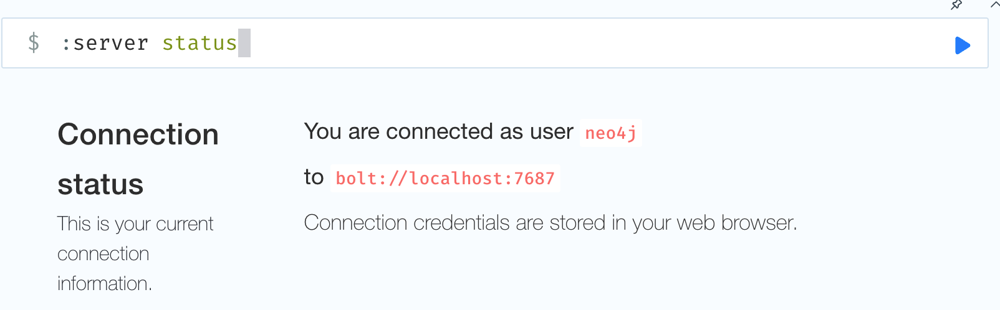

**Title**: Explore the Academic World (Help students pick their graduate school)

**Purpose**: This application allows users to explore and utilize the Academic
World dataset through a web-based dashboard application. It is designed for
faculty members, students, and data enthusiasts who are interested in analyzing
academic data through relational(MySQL), document(MongoDB), and graph(Neo4j)
databases. The objectives of the application are to provide insights into the
dataset, facilitate data exploration, and demonstrate the integration of
different database technologies.

**Demo**: [Demo video](https://mediaspace.illinois.edu/media/t/1_n8d9tzz6)

**Installation**: Install the required packages specified in the requirement.txt
file through the following command:  
`pip install -r requirement.txt`

This application will be running locally, therefore, will need to change the
configuration in the .env file. Change the corrsponding parameters (database
user and password) before starting the application.

- Connecting MySQL  
  Change the **username** and **password** to match your local configuration.

- Connecting MongoDB  
  Change the MongoDB URL to match your local configuration.

- Connecting Neo4J  
  Find the **user** and **URL** using the `server status` command.
  

**Usage**

- Explore keywords, faculty and publications through interactive graphs.
- Perform queries by entering input values on the graph, to explore the
  realtionship between keywords and publications.

**Design**

- Frontend: A dashboard built using Dash Core Component, Dash Boostrap Component
  and basic HTML; the figures are created using `dash_ag_grid`,
  `matplotlib.pyplot` and `plotly.express` with the help of `pandas` to format
  data. There are 6 widgets, and each widget is a `dbc.Card` component. The
  dashboard is formatted such that there are 3 rows, and 2 widgets in each row.
- Backend: there are three backend files: mongodb_utils.py, mysql_utils.py, and
  neo4j_utils.py. This files are used as APIs to connect to local databases, and
  for code readibility.

The application is structured into the following components:

1. Top X popular keywords based on number of publications. (MYSQL)
2. Top-10 publications by choosing the keyword.(MySQL)
3. Rank faculty/university who have the highest keyword-relevant citations(KRC)
   for the selected keyword. (MongoDB)
4. Faculty ranking who have the highest keyword-relevant citations(KRC) for the
   selected keyword (multiple keywords). (Neo4j)
5. Faculty information widget to show the basic faculty member page. Update/edit
   functionality is enabled. (MySQL)
6. Publication detail page, where user can search for publication published by
   faculty; able to update publication info (title, venue, year, number of
   citations) as needed. (MongoDB)

**Implementation**

- Write 3 APIs files make connections between MySQL, MongoDB, and Neo4J locally.
  Query can be done through the APIs. Libraries used in connecting databases:
  `mysql-connector-python`, `pymongo`, `neo4j`. Used python libraries `pandas`,
  `matplotlib`, and `ploty` to format and visulize data using graph.
- The frontend is formated using Dash Core Component, Dash Boostrap Compoment,
  HTML and CSS to style and position the components. Created a dynamic website,
  enabled user interaction, using dash callback function. Libraries used:
  `dash-ag-grid`, `dash-bootstrap-components`, `dash`.

**Database Techniques**

- **Index**: Created indexes in MongoDB when initializing the database object,
  create indexes for attribute (id, keywords.name) to make query faster.

```
class MongoDB():
    def __init__(self):
        self.client = get_database()
        self.client["publications"].create_index([('id', ASCENDING)])
        self.client["publications"].create_index([('keywords.name', ASCENDING)])
```

- **Constraint**: Constraint for the publication year is added, so that the user
  can not update the year to earlier than 1500 (this value can be modified by
  calling the function and pass a maxYear variable).

```
def add_constraint(self, maxYear=2024):
    validation_rule = {
        "$jsonSchema": {
            "bsonType": "object",
            "required": ["year"],
            "properties": {
                "year": {
                    "bsonType": "int",
                    "minimum": 1500,
                    "maximum": maxYear,
                    "description": "must be an integer between 1500 and 2024 and is required"
                }
            }
        }
    }
    # Publications = self.client["publications"]
    self.client.command({
        "collMod": "publications",
        "validator": validation_rule,
        "validationLevel": "strict"
    })
    print("Collection updated with validation.")
```

- **Prepared Statements**: Prepared statements allow execute the same SQL
  statement multiple times with high efficiency. In SQL, we create prepared
  statement through the command `PREPARE stmt FROM '(query statement)';`, in
  python, we can archieve the same purpose by defining a query statement in a
  variable, pass the parameter (if any) throug function parameter. We can simply
  call the function in the frontend instead of writing a query every time.

  Our implementation includes writing database classes, which has some functions the object can call to make query to the database. This implementation acts as the same purpose of prepared statement: MySQL uses `PREPARE statement` to create a `statement` for resuability and our implementation uses python function, which has the same functionality as prepared statement in MySQL.

```
def prepared_statement(self):
    statement = 'SELECT * FROM keyword;'
    cnx = self.client
    cursor = cnx.cursor()
    query = "prepare getAllKeywords from 'SELECT * FROM keyword';"
    cursor.execute(query)

def get_keywords(self):
    cnx = self.client
    cursor = cnx.cursor()
    
    cursor.execute('execute getAllKeywords;')
    
    keywords = []
    results = cursor.fetchall()
    for row in results:
        # print(row)
        keywords.append(row[1])
    cursor.close()
    return keywords
```

**Extra-Credit Capabilities**

**Contributions**
- Minghao Lin: completed widget 3, 4, 6; implemented database techniques; recorded video; readme; Time Spent: 30 ~ 35 hours

- Yawen Wang: completed widget 1, 2, 5; implemented database techniques; readme; Time Spent: 30 ~ 35 hours